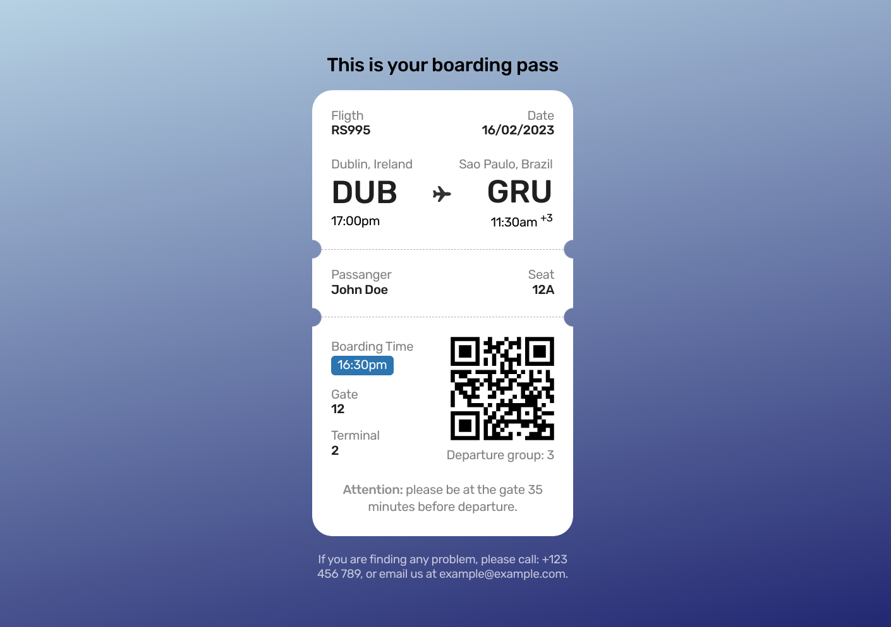

  <h1 align="center">💻 Boarding Pass</h1>

## Details:

This is a project developed during the 6th challenge of the `#boraCodar` which means `letsCoding` from `RocketSeat` community, which is a community of developers who are always looking to improve their skills and help others.
- HTML
- CSS

> See this project on Figma: [Boarding Pass](https://www.figma.com/proto/gd8jh4OX9tse0PsaBmACBN/%23boraCodar---Desafio-6-(Community)?node-id=1%3A878)

## 📷 Screenshots:

  

## 🤝 References:

- [RocketSeat](https://rocketseat.com.br/)
- [Mayk Brito](https://github.com/maykbrito)

---

<strong>Built with 💙 by [@Marcos Oliveira](https://www.linkedin.com/in/pgmarcosoliveira/)</strong>